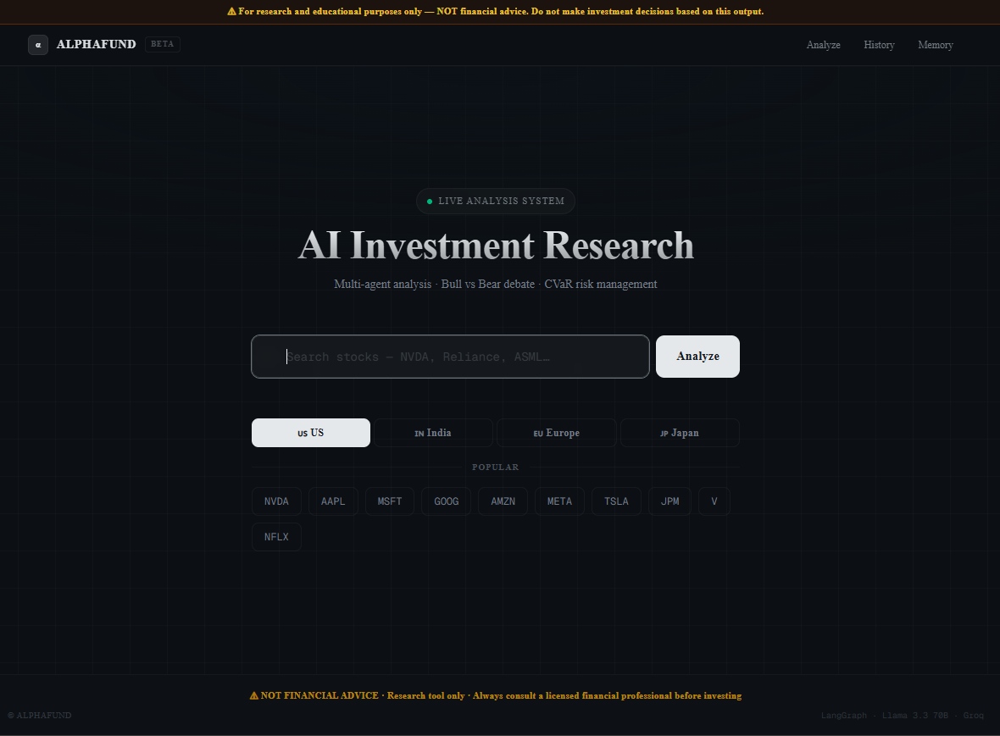
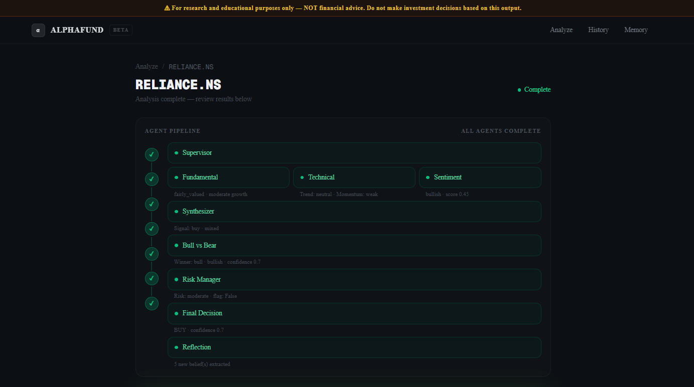
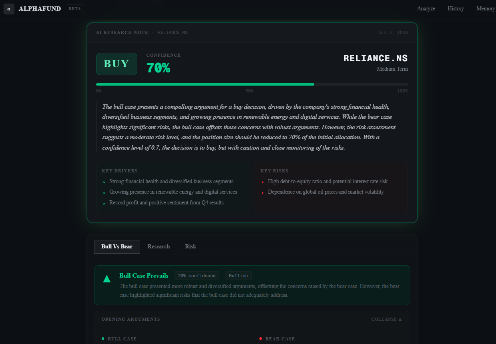
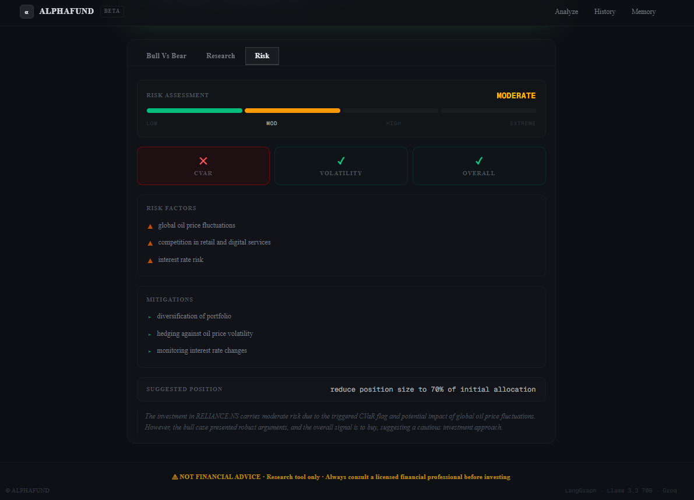

# AlphaFund — AI Investment Research System

<p align="center">
  
  
  
  
  
  
</p>

> [!WARNING]
> **NOT FINANCIAL ADVICE.** This project is for **research and educational purposes only.** Do not make investment decisions based on its output. Always consult a licensed financial professional before investing.

<br/>

<p align="center">
  
</p>

---

## Table of Contents

- [Overview](#overview)
- [How It Works](#how-it-works)
- [Features](#features)
- [Screenshots](#screenshots)
- [Research Foundation](#research-foundation)
- [Tech Stack](#tech-stack)
- [Getting Started](#getting-started)
- [Project Structure](#project-structure)
- [Token Budget](#token-budget)
- [Deploy vs Open-Source](#deploy-vs-open-source)
- [License](#license)

---

## Overview

AlphaFund is a **multi-agent AI investment research system** built on [LangGraph](https://github.com/langchain-ai/langgraph). It orchestrates 8 specialised agents to produce structured investment recommendations — BUY, HOLD, or SELL — backed by fundamental analysis, technical indicators, news sentiment, a structured bull-vs-bear debate, and CVaR risk assessment.

The architecture directly implements findings from three financial AI research papers: **FINCON** (hierarchical agents, 3-layer memory, Conceptual Verbal Reinforcement), a **multi-agent benchmarking** study (hierarchical beats peer-to-peer; Pydantic validation gates prevent cascading failures), and **D3** (structured debate with deliberation reduces variance in financial judgements). Everything runs on free-tier APIs — no paid LLM subscription required.

---

## How It Works

```
User Query ("Analyze NVDA")
        │
        ▼
    Supervisor                    ← no LLM · loads memory + beliefs from past runs
        │
   ┌────┴──────────────┬──────────────────────┐
   ▼                   ▼                      ▼
Fundamental         Technical              Sentiment        ← parallel · 8B model
(SEC + yfinance)    (pandas-ta)            (NewsAPI)
   │                   │                      │
   └───────────────────┴──────────────────────┘
                        │
                        ▼
                   Synthesizer                              ← hierarchical merge · 70B
                        │
                        ▼
               Bull vs Bear Debate                          ← single structured call · 8B
               (opening args · rebuttals · winner)
                        │
                        ▼
                  Risk Manager                              ← CVaR + volatility · 70B
                        │
           ┌────────────┴───────────┐
     risk_flag=True           risk_flag=False
           │                        │
     → Supervisor              Final Decision               ← BUY/HOLD/SELL · 70B
       (re-route)                   │
                                    ▼
                               Reflection                   ← CVRF belief extraction · 8B
```

<p align="center">
  
  <br/>
  <sub>Live agent pipeline — each node streams its completion summary in real time via Server-Sent Events.</sub>
</p>

---

## Features

- **Hierarchical multi-agent graph** — Supervisor injects past beliefs into each run; 3 analysts execute in parallel; Synthesizer aggregates; Debate arbitrates; Risk Manager gates before the final call
- **Bull vs Bear debate** — opening arguments, rebuttals, and winner determination in a single structured LLM call, avoiding the 5-call overhead of naive debate pipelines
- **CVaR risk gates** — Conditional Value at Risk (95%) and 30-day volatility checks; high-risk states route back to Supervisor rather than proceeding to Final Decision
- **CVRF belief learning** — after every run, the Reflection agent extracts 3–5 investment beliefs from profitable vs unprofitable patterns and injects them into future runs (FINCON's Conceptual Verbal Reinforcement)
- **3-layer memory** — working memory (LangGraph state), procedural memory (ChromaDB with 14-day timeliness decay), episodic memory (SQLite decisions + beliefs)
- **Real-time streaming UI** — SSE-powered agent timeline; the Verdict Card appears the moment Final Decision fires
- **Global market coverage** — US, India, Europe, Japan with live ticker autocomplete via `yfinance.Search()`
- **100% free to run** — Groq free tier, yfinance, ChromaDB, SQLite, NewsAPI free tier — zero infrastructure cost

---

## Screenshots

<table>
  <tr>
    <td width="50%">
      
      <p align="center"><sub><b>AI Research Note</b> — verdict card with confidence score, key drivers, key risks, and the full bull vs bear transcript</sub></p>
    </td>
    <td width="50%">
      
      <p align="center"><sub><b>Risk Assessment</b> — CVaR flag, LOW → EXTREME segmented gauge, risk factors, mitigations, and suggested position sizing</sub></p>
    </td>
  </tr>
</table>

---

## Research Foundation

This project synthesises three papers into a single architecture:

| Paper | Key Contribution Applied |
|-------|--------------------------|
| **FINCON** (2024) | Hierarchical topology (no peer-to-peer chatter), 3-layer memory system, CVRF belief extraction from profitable vs unprofitable trajectories |
| **Benchmarking Multi-Agent LLM Architectures for Financial Document Processing** (2024) | Hierarchical beats sequential/parallel/reflexive on accuracy–cost balance; Pydantic validation gates with single retry + confidence penalty to prevent cascading errors |
| **D3: Deliberative Discussion and Decision** (2024) | Structured debate with opening arguments, rebuttals, and cost-aware winner determination in one call — measurably reduces variance vs single-pass evaluation |

Full architecture notes and state schema are in `docs/PLAN.md` (internal, not included in the public repo).

---

## Tech Stack

| Component | Technology | Notes |
|-----------|-----------|-------|
| Orchestration | LangGraph 0.2+ | Stateful graph, MemorySaver checkpointing, parallel fan-out |
| LLM — quality nodes | Groq `llama-3.3-70b-versatile` | Synthesizer, Risk Manager, Final Decision |
| LLM — volume nodes | Groq `llama-3.1-8b-instant` | Fundamental, Technical, Sentiment, Debate, Reflection |
| Embeddings | `sentence-transformers` (local) | `all-MiniLM-L6-v2` — no API cost |
| Vector store | ChromaDB (local) | Procedural memory with timeliness decay scoring |
| Episodic memory | SQLite (local) | Decision history + CVRF beliefs |
| Financial data | `yfinance`, `sec-edgar-downloader` | OHLCV, fundamentals, 10-K / 10-Q filings |
| News sentiment | NewsAPI (free tier) | 100 req/day — sufficient for personal use |
| Technical indicators | `pandas-ta` | RSI, MACD, Bollinger Bands, ATR, EMA |
| API server | FastAPI + Uvicorn | REST + SSE streaming, 30-min result cache |
| Frontend | Next.js 14, TypeScript, Tailwind CSS, shadcn/ui | App Router, dark theme, real-time streaming |

---

## Getting Started

### Prerequisites

- Python 3.10+
- Node.js 18+ _(only needed for the frontend)_
- [Groq API key](https://console.groq.com) — free
- [NewsAPI key](https://newsapi.org) — free (100 req/day)

### Installation

```bash
git clone https://github.com/your-username/AI_Hedge_Fund.git
cd AI_Hedge_Fund

python -m venv .venv
source .venv/bin/activate        # macOS / Linux
# .venv\Scripts\activate         # Windows

pip install -r requirements.txt

cp .env.example .env             # then edit .env and add your keys
```

### Run — CLI only

```bash
python main.py --ticker NVDA
```

Runs the full 8-agent pipeline and prints the trace + final decision to stdout. No frontend required.

### Run — Full Stack

```bash
# Terminal 1 — backend API
uvicorn api.main:app --reload --port 8000

# Terminal 2 — frontend
cd frontend && npm install && npm run dev
```

Open [http://localhost:3000](http://localhost:3000)

### Environment Variables

| Variable | Required | Where to get it |
|----------|----------|-----------------|
| `GROQ_API_KEY` | Yes | [console.groq.com](https://console.groq.com) — free |
| `NEWSAPI_KEY` | Yes | [newsapi.org](https://newsapi.org) — free |
| `GOOGLE_API_KEY` | No | [aistudio.google.com](https://aistudio.google.com) — Gemini fallback |
| `SEC_USER_AGENT` | No | Any string, e.g. `MyBot admin@example.com` |

---

## Project Structure

```
AI_Hedge_Fund/
├── src/
│   ├── agents/
│   │   ├── supervisor.py          # Memory injection — no LLM
│   │   ├── fundamental.py         # SEC EDGAR + yfinance · 8B
│   │   ├── technical.py           # pandas-ta indicators · 8B
│   │   ├── sentiment.py           # NewsAPI headlines · 8B
│   │   ├── synthesizer.py         # Hierarchical aggregation · 70B
│   │   ├── debate.py              # Bull / bear / rebuttal / winner · 8B
│   │   ├── risk_manager.py        # CVaR + volatility gates · 70B
│   │   ├── final_decision.py      # BUY / HOLD / SELL · 70B
│   │   ├── reflection.py          # CVRF belief extraction · 8B
│   │   └── llm_client.py          # Model routing + per-role rate guard
│   ├── graph/
│   │   ├── state.py               # HedgeFundState TypedDict
│   │   ├── workflow.py            # Graph assembly + node wiring
│   │   └── routing.py             # Conditional edges (risk loop)
│   ├── memory/
│   │   ├── procedural_memory.py   # ChromaDB + timeliness decay
│   │   └── episodic_memory.py     # SQLite decisions + beliefs
│   └── tools/
│       ├── yfinance_tool.py
│       ├── sec_edgar_tool.py
│       ├── technical_tool.py
│       └── news_tool.py
├── api/
│   ├── main.py                    # FastAPI app entry
│   ├── streaming.py               # SSE generator + 30-min result cache
│   └── routes/                    # analyze · history · memory · search
├── frontend/
│   ├── app/                       # / · /analyze/[ticker] · /history · /memory
│   └── components/                # AgentTimeline · VerdictCard · DebateView · ResearchTabs · RiskMeter
├── main.py                        # CLI entrypoint
├── requirements.txt
└── .env.example
```

---

## Token Budget

Optimised to stay within Groq's free-tier limits. Per-role `max_tokens` caps and a sliding-window rate guard are enforced in `llm_client.py`.

| Model | Nodes | Calls / run | Tokens / run | Daily pool |
|-------|-------|-------------|--------------|-----------|
| `llama-3.1-8b-instant` | Fundamental, Technical, Sentiment, Debate, Reflection | 5 | ~5,000 | 500,000 |
| `llama-3.3-70b-versatile` | Synthesizer, Risk Manager, Final Decision | 3 | ~2,200 | 100,000 |
| **Total** | | **8** | **~7,200** | |

---

## Deploy vs Open-Source

**Recommendation: keep this open-source and run it locally with your own keys.**

Deployment has hard technical blockers at the free tier:

| Blocker | Detail |
|---------|--------|
| Shared API quota | Groq free tier is per-account, not per-user. At ~7,200 tokens/run, the 70B daily limit (100K tokens) supports roughly 13 full runs before it resets — one busy hour exhausts it for everyone. |
| No multi-user isolation | The in-memory session store and local ChromaDB / SQLite are single-process by design. Multi-user support requires an auth layer, per-user databases, and a job queue — a significant rewrite. |
| Data source rate limits | NewsAPI free tier caps at 100 requests/day. SEC EDGAR enforces request limits that break under concurrent traffic. |
| No serverless option | FastAPI + LangGraph requires a persistent process. It cannot run on Vercel or Netlify. A dedicated server adds ongoing cost. |
| Legal exposure | Hosting a live BUY / SELL / HOLD system introduces regulatory ambiguity even with disclaimers. Open-source shifts responsibility to each user who chooses to run it. |

Each user who clones the repo brings their own free Groq and NewsAPI keys — their quota is fully independent. The architecture, agent design, memory system, and CVRF belief learning are the valuable artifacts, not the hosted service.

If a public demo becomes necessary, the right approach is to pre-compute a set of cached analyses and serve those statically — never route live user queries through a shared API key.

---

## License

MIT © 2026

---

## Acknowledgements

- [FINCON: A Synthesized LLM Multi-Agent System with Conceptual Verbal Reinforcement for Enhanced Financial Decision Making](https://arxiv.org/abs/2407.06567)
- Benchmarking Multi-Agent LLM Architectures for Financial Document Processing (2024)
- D3: Deliberative Discussion and Decision for Multi-Agent Financial Reasoning (2024)
- [LangGraph](https://github.com/langchain-ai/langgraph) — agent graph orchestration
- [Groq](https://groq.com) — free-tier LLM inference
